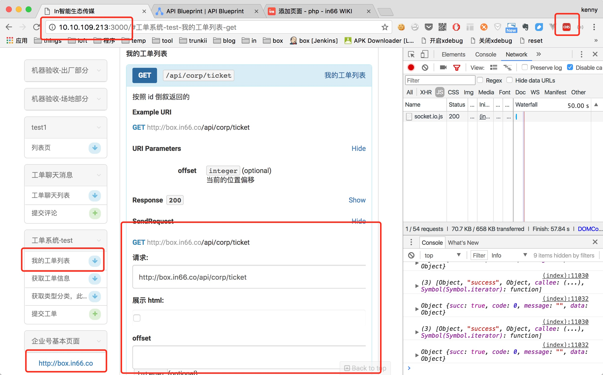
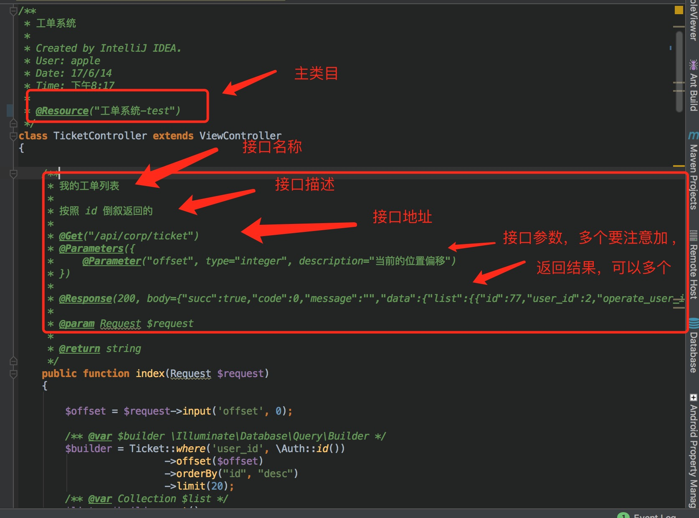
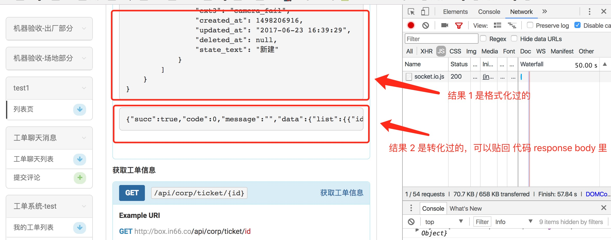
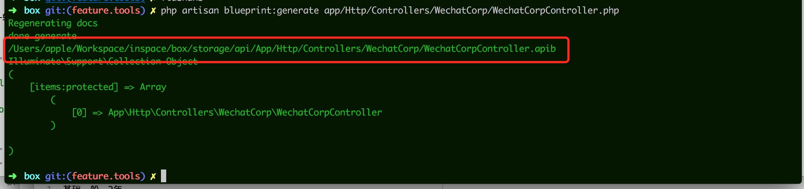

# 接口文档，生成测试工具，标准 blueprint 

1. blueprint 是一个接口文档规范，特别适合做 restful 的接口描述 [https://apiblueprint.org/](https://apiblueprint.org/)
2. 针对 laravel 做了一套工具，用于持续产出文档，并提供前后端调试 

## 特性 

1. 支持 restful 请求 
2. 依赖 larvel 的命令行 
3. 修改了 dingo 的 blueprint 自定义支持 
4. 修改 npm 包 aglio，提供直接在文档 h5 上进行调试 
5. 可以根据需要生成所有接口，或者部分接口 

## 示例

1. 结果
    * 
    * 可以指定 app_host，用于发送请求给不同的环境 
    * 选择需要的接口调试
    * 直接发请求，支持所有 restful 请求，使用 jquery ajax 实现 
    * 需要安装 cros chrome 插件，用于跨域处理 

2. composer 添加依赖 
    * 依赖内网仓库 http://packagist.in66.cc:8080/
        
        ```
        "repositories": [
            {
                "type": "composer",
                "url": "http://packagist.in66.cc"
            }
        ]
        ```
    * `composer require in/blueprint:dev-master`
    * laravel app 添加 provider 

        ```
        // api 工具
        In\Blueprint\Laravel\BlueprintServiceProvider::class,
        ```
    


2. 文件描写 
    * 
    * 格式要求比较严格
    * 原始文档，[https://github.com/dingo/api/wiki/API-Blueprint-Documentation](https://github.com/dingo/api/wiki/API-Blueprint-Documentation)
    * 坑点
        * 多个参数，要加 ',' 区分 
        * 注意不能使用 '' 划分
        * @Response 返回的 body 有特殊要求，不支持 [] 数组类型，实际开发中，一般是生成一轮文档后，在 h5 页面上请求，能直接得到转换过的值 
            * 

3. 运行生成命令 
    * 生成所有文档，会扫描 app\Http\Controllers 里的 所有文件 `php artisan blueprint:generate`
    * 生成单个 controller 的文档，`php artisan blueprint:generate app/Http/Controllers/WechatCorp/WechatCorpController.php`
        * 
        * 图示的是生成的文件位置
    
4. 展示控件安装 
    * 需要在内网安装 
    * `npm install -g git+ssh://git@githost.in66.cc:yidu/aglio.git`
    
5. 运行展示 
    * 安装后会多了个 aglio 的命令，默认端口 3000，也能生成静态文件 
    * `aglio -i storage/api/blueprint.apib -s -h 0.0.0.0`
    * aglio 是基于 [https://github.com/danielgtaylor/aglio](https://github.com/danielgtaylor/aglio) 修改的

### 持续特性 

1. 内部类文档支持，主要是针对 laravel 系列的 job, lisener, facade, service 
2. 增加 json schema 的验证 
3. 接入到公司的 jenkins 测试中 


# API Blueprint Generator

[](https://travis-ci.org/dingo/blueprint)
[](https://packagist.org/packages/dingo/blueprint)


[](https://styleci.io/repos/37761089)

This package generates a valid API Blueprint 1A document from a collection of classes.

## Usage

Some index method phpdoc example:

```
<?php

/**
 * Products
 *
 * @Resource("Products", uri="/products")
*/
class ProductsController extends ApiController
{
    /**
     * Products list
     *
     * Get current products list
     * 
     * @Get("/")
     * @Versions({"v1"})
     * @Transaction({
     *      @Request(identifier="/?state=synced"),
     *      @Response(200, body={"data":{{"id":"rkoVJ7qa4Z6lzXdVnldgx9LmpBP0DQ3e","name":"Product name","status":"active"}},"meta":{"pagination":{"total":1,"count":1,"per_page":1,"current_page":1,"total_pages":1,"links":{}}}})
     * })
     * @Parameters({
     *      @Parameter("api_token", type="string", required=true, description="API Token", default=null),
     *      @Parameter("page", type="integer", required=false, description="Pagination page", default=1),
     *      @Parameter("state", type="string", required=false, description="Product status filter", default="synced", members={
     *          @Member(value="synced", description="Products synced"),
     *          @Member(value="pending", description="Products pending")
     *      })
     * })
     */
    public function index(Request $request)
    {}
}
```

## extend

1. add laravel job to generate api files 
2. App Host 

### service api, for laravel part  
 
### event api 

### facade api  

### helper function api  

### jobs api 

### command api  

## License 

This package is licensed under the [BSD 3-Clause license](http://opensource.org/licenses/BSD-3-Clause).
